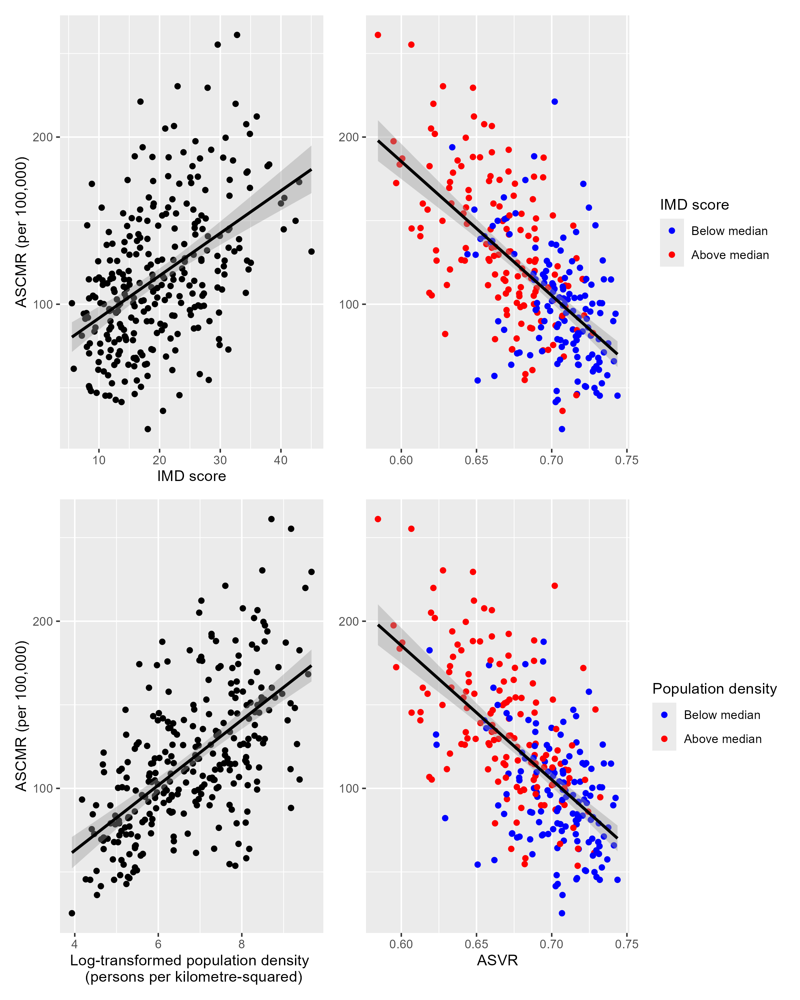
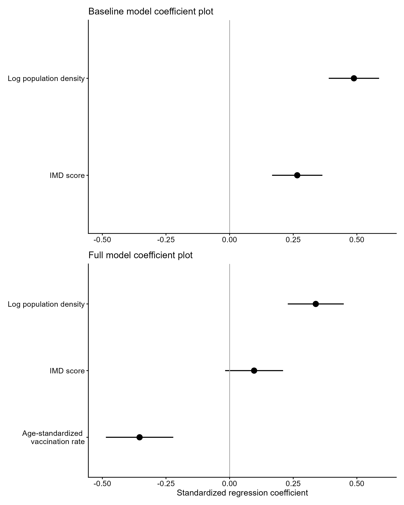

```{r}
#| echo: false
#| eval: true
#| message: false
#| warning: false

library(tidyverse)
library(tidyr)
library(readr)
library(sf)
library(patchwork)
library(ggrepel)
library(ggspatial)
library(broom)

all_data<-read.csv('geospatial-analysis-covid-mortality\\processing\\processed_data.csv')

```

## Introduction

On 8 December 2020, the UK became the first country to launch a national pandemic COVID-19 vaccination programme. A combination of local and mass vaccination sites ensured rapid vaccine rollout, and by the end of October 2021 85% of adults in England had received two doses (NAO, 2022). Nevertheless, substantial COVID-19 mortality persisted throughout 2021 despite vaccine rollout targeting the oldest and most vulnerable. In 2021, more than 67,000 deaths due to COVID-19 were recorded across England and Wales, which was not strikingly different from the 73,766 deaths recorded in 2020 (ONS, 2022a). This raises the question of the extent to which geographical variation in other factors may have influenced COVID-19 mortality across English local authorities.

Geographical variation in population density and index of multiple deprivation (IMD) have been shown to be positively associated with death due to COVID-19 (Bray, Gibson & White, 2020; Morrissey et al, 2021). Population density is included as a proxy for urbanization, since higher-density areas are more likely to exhibit characteristics such as more diverse populations and greater household crowding (Polinesi et al, 2020), which have been shown to contribute to more rapid COVID-19 transmission (Ghosh et al, 2021). Moreover, IMD score encompasses health inequality in addition to broader measures of socioeconomic deprivation which have been associated with increased COVID-19 mortality. Therefore, this study investigates whether spatial variation in population density and IMD score in addition to vaccination uptake helps explain geographical variation in COVID-19 mortality across English local authorities.

## Methods

### Data

Data were obtained for English local authorities. The variables included age-standardized COVID-19 mortality rates (ASCMR) 2020 and 2021 from the Office for National Statistics (ONS). Vaccination data by age group from NHS England; Index of Multiple Deprivation (IMD) 2019 scores from the UK Government; and population by age-group and population density from NOMIS (ONS).

### Data Preparation

Vaccination counts and population were aggregated into four broad age groups (\<18, 18 - 39, 40 - 59 and $\geq$ 60). Age-standardized vaccination rate (ASVR) was then calculated using the formula:

$$ASVR=\frac{\sum^4_{i=1}\:p_i\:ESP_i}{100000}$$

where $p_i$ is the age-specific vaccination rate for age group *i* and $ESP_i$ is the corresponding European Standard population weight aggregated to the same four age groups.

ASVR values merged with the remaining datasets using local authority codes. Boundary changes between data releases reduced the final dataset to 287 from 309 English local authorities.

### Data Description

| Variable Name  | Variable Value | Measurement Level |
|----------------|----------------|-------------------|
| area_code      | E6000047       | Nominal           |
| area_name      | County Durham  | Nominal           |
| death_rate2020 | 194.8          | Ratio             |
| death_rate2021 | 98.7           | Ratio             |
| vax_rate       | 0.709          | Ratio             |
| IMD_score      | 26.793         | Interval          |
| pop_dens       | 234            | Ratio             |

: Data description of variables including variable name, example value and measurement level.

### Data Analysis

To provide context for subsequent geospatial analyses, 2021 ASCMR was compared with 2020 values using a paired Wilcoxon signed-rank test. Subsequently, the mortality rate ratio (MRR) was calculated for each local authority according to the formula:

$$ MRR = \frac{ASCMR\:2021}{ASCMR\:2020} $$

with median MRR used to summarise relative change in mortality.

Population density was log-transformed to reduced positive skew. Scatter plots of the response, ASCMR 2021, against predictor variables IMD score, log-transformed population density (LTPD) and ASVR were produced. For plots of ASCMR against ASVR, raw population density and IMD score were divided at the median and distinguished by point colour to facilitate comparison of an additional variable within a scatter plot. Relationships were quantified statistically using Pearson's correlation coefficient ($r$).

Multiple linear regression was used to evaluate the associations between variables on the response. Variables were z-score standardized to allow direct comparison of regression coefficients. Homoskedasticity and normality of residuals were assessed using residual versus fitted and Q-Q plots, respectively. Multicollinearity was evaluated using variance inflation factors, with values greater than 5 indicative of collinear variables. To evaluate the influence of ASVR on the model, a baseline model was fit including only IMD score and LTPD which was compared to the full model including ASVR. Coefficient plots with 95% confidence intervals were used to summarise the magnitude and direction of coefficient estimates in both baseline and final models. A choropleth map of residuals was produced to examine the spatial distribution of prediction errors made by the full model. Spatial clustering of model residuals was assessed using global Moran's I. Spatial neighbours were defined using a five-nearest-neighbour approach based on local authority centroids, and spatial weights were row-standardized

## Results

### Comparison of Death Rates in 2020 with Death Rates in 2021

The Wilcoxon signed-rank test revealed a significant decrease in ASCMR between 2020 and 2021 ($V = 25614$, $p < 0.01$). Median ASCMR decreased from 121.55 to 111.65 deaths per 100,000. The median local authority MRR was 0.951, indicating a median within-authority relative reduction of approximately 4.9%.

### Exploratory analysis of relationships between predictor variables and ASCMR

```{r}
#| echo: true
#| eval: false
#| warning: false
#| message: false
#| fig-width: 8
#| fig-height: 10
#| fig-cap: 'Relationships between age-standardized COVID-19 mortality rate (ASCMR) and predictor variables.'

# Divide variables at median to create binarized variables
all_data<- all_data|>
  mutate(pop_dens_binary=ifelse(pop_dens >= median(pop_dens),1,0),
         imd_binary=ifelse(IMD_score >= median(IMD_score),1,0))

# Convert to factors with labels to be displayed in figure legend
all_data <- all_data|>
  mutate(pop_dens_binary = factor(pop_dens_binary, levels=c(0,1), labels= c('Below median', 'Above median')),
         imd_binary=factor(imd_binary, levels=c(0,1), labels= c('Below median', 'Above median')))

# Scatter plot of ASVR (std_vax) and 2021 ASCMR (death_rate2021) separated by IMD group
p1 <- all_data|>
  ggplot(aes(x=std_vax, y=death_rate2021, color=imd_binary)) +
  geom_point() +
  labs(x =NULL, 
       y=NULL,
       colour = 'IMD group') +
  scale_colour_manual(
    name = 'IMD score',
    values = c('Below median' = 'blue',
               'Above median' = 'red')
  ) +
  geom_smooth(method = "lm", color='black')

# Scatter plot of IMD_score and 2021 ASCMR
p2<-all_data|>
  ggplot(aes(IMD_score, death_rate2021))+
  geom_point()+
  labs(x='IMD score', y='ASCMR (per 100,000)') +
  geom_smooth(method = "lm", color='black')

# Scatter plot of ASVR (std_vax) and 2021 ASCMR (death_rate2021) separated by population density group

p3 <- all_data|>
  ggplot(aes(x=std_vax, y=death_rate2021, color=pop_dens_binary)) +
  geom_point() +
  labs(x = 'ASVR',
       y=NULL,
       colour = 'Population density') +
  scale_colour_manual(
    name = 'Population density',
    values = c('Below median' = 'blue',
               'Above median' = 'red')
  ) +
  geom_smooth(method = "lm", color='black')

# Scatter plot of log transformed population density and ASCMR
p4<-all_data|>
  ggplot(aes(log1p(pop_dens), death_rate2021))+
  geom_point()+
  labs(x='Log-transformed population density \n (persons per kilometre-squared)', y='ASCMR (per 100,000)') +
  geom_smooth(method = "lm", color='black')

# Organize and display combination plot
(p2+p1) / (p4+p3)
```

```{r}
#| echo: false
#| eval: true
#| fig-width: 8
#| fig-height: 10


```

Figure 1 suggests that all predictor variables exhibit approximately linear relationships with ASCMR. The top and bottom left panels suggest positive linear relationships between IMD score and LTPD, with IMD score exhibiting more sparsely distributed scatter. The top and bottom right panels suggest a negative association between ASVR and ASCMR. In addition, areas above the median IMD score and population density tend to exhibit higher ASCMR and lower ASVR. Whereas values below the median generally exhibit lower ASCMR and higher ASVR. Pearson's correlation analyses support these observations; a significant negative association was identified between ASVR and ASCMR ($r = -0.633,\: p<0.001$), positive association between IMD score and ASCMR ($r = 0.482,\: p<0.001$), and a positive association between LTPD and ASCMR ($r = 0.606,\: p<0.001$).

### Linear Modelling

The full model was statistically significant ($F(3,283)= 85.22, \: p<0.001$) explaining 46.99 % of the variance in the ASCMR (adjusted $R^2 = 0.4699$). Residual diagnostics including residual-versus-fitted and Q-Q plots indicated no substantial violations of assumptions of homoscedasticity or normality. However, Moran's I identified significant spatial autocorrelation in residuals (Moran's $I=0.470,\:p<0.001$), indicating the assumption of independent residuals was violated. Therefore, statistical inference of the ordinary least squares (OLS) model, particularly standard errors, confidence intervals and p-values should be interpreted cautiously. Variance inflation factors for all predictors were less than 5, indicating no evidence of strong multicollinearity.

The associations of model predictors IMD score, LTPD and inclusion of ASVR with the response, ASCMR, in baseline and full models are compared in the coefficient plot in Figure 2.

### Standardized regression coefficients for baseline and full models

```{r}
#| echo: true
#| eval: false
#| fig-width: 6
#| fig-height: 8
#| fig-cap: 'Z-score standardized coefficient plot with 95% confidence intervals of model predictors included in the baseline model (IMD score and population density - top panel) and in the full model (ASVR included - bottom panel) on the response ASCMR.'

# z-score transform data
model_data<-all_data|>
  mutate(log_pop_dens=log1p(pop_dens))|>
  mutate(across(c(death_rate2021, std_vax, IMD_score, log_pop_dens), ~as.numeric(scale(.)),
                .names='z_{col}'))

# Fit regression model with z-score transformed data

# Specify model with ASCMR as response and IMD score and log-transformed population density as predictors
modelA<-lm(formula=z_death_rate2021 ~ z_IMD_score + z_log_pop_dens, data=model_data, na.action = na.exclude)

# Specify model with ASCMR as response and ASVR, IMD score, and log-transformed population density as predictors
modelB<-lm(formula=z_death_rate2021 ~ z_std_vax + z_IMD_score + z_log_pop_dens, data=model_data, na.action = na.exclude)

# Prepare both models for coefficient plots
coef_dfA <- tidy(modelA, conf.int = TRUE)

# Recode variables for legend
coef_dfA<-coef_dfA |>
  mutate(
    term = dplyr::recode(
      term,
      'z_std_vax' = 'Age-standardized \n vaccination rate',
      'z_IMD_score' = 'IMD score',
      'z_log_pop_dens' = 'Log population density'
    )
  )

coef_dfB <- tidy(modelB, conf.int = TRUE)

coef_dfB<-coef_dfB |>
  mutate(
    term = dplyr::recode(
      term,
      'z_std_vax' = 'Age-standardized \n vaccination rate',
      'z_IMD_score' = 'IMD score',
      'z_log_pop_dens' = 'Log population density'
    )
  )

# Plot coefficient plots
p5<-coef_dfA |>
  filter(term !='(Intercept)')|>
  ggplot(
    aes(x=term,
        y=estimate, ymin=conf.low,
        ymax=conf.high))+
  labs(x=NULL,y=NULL,title='Baseline model coefficient plot') +
  geom_pointrange(size = 0.7, linewidth = 0.7) +
  geom_hline(yintercept=0, colour='darkgrey') +
  coord_flip() +
  scale_y_continuous(limits=c(-0.5,0.6), breaks = seq(-0.5,0.5, by=0.25)) +
  theme_classic()+
  theme(
    axis.text = element_text(size = 11),
    axis.title.x = element_text(size = 12))

p6<-coef_dfB |>
  filter(term !='(Intercept)')|>
  ggplot(
    aes(x=term,
        y=estimate, ymin=conf.low,
        ymax=conf.high))+
  labs(x=NULL,y='Standardized regression coefficient', title='Full model coefficient plot') +
  geom_pointrange(size = 0.7, linewidth = 0.7) +
  geom_hline(yintercept=0, colour='darkgrey') +
  coord_flip() +
  scale_y_continuous(limits=c(-0.5,0.6), breaks = seq(-0.5,0.5, by=0.25)) +
  theme_classic()+
  theme(
    axis.text = element_text(size = 11),
    axis.title.x = element_text(size = 12)
  )

plotB<- p5 / p6
```

```{r}
#| echo: false
#| eval: true
#| fig-width: 8
#| fig-height: 10


```

In the coefficient plot for the baseline model (Figure 2, top panel), LTPD and IMD score were positively associated with ASCMR, with 95% confidence intervals that did not include zero. The baseline model had an adjusted R^2^ of 0.42. After including ASVR in the full model (Figure 2, bottom panel), IMD score was no longer statistically significant ($\beta = 0.096, p=0.097$). Adjusted R^2^ increased to 0.47, indicating improved explanatory performance after inclusion of ASVR. LTPD remained positively associated with mortality rate ($\beta = 0.338, p<0.001$), whereas ASVR exhibited a negative association with mortality rate($\beta = -0.354, p<0.001$).

### Geographical distribution of model residuals

```{r}
#| echo: true
#| eval: false
#| warning: false
#| message: false
#| fig-width: 8
#| fig-height: 10
#| fig-cap: 'Spatial distribution of model residuals plotted for English local authorities. The 5 largest positive and 5 largest negative residuals are labelled.' 
# Load English lower tier local authorities (ltla) polygon layer  
ltla <- st_read("LAD_DEC_2021_GB_BFC.shp", quiet=TRUE)

# Extract model residuals 
model_data<-model_data|>
  mutate(model_residuals=residuals(modelB))

# Prepare and join ltla polygons with model data
ltla_eng<-ltla|>
  rename(area_code=LAD21CD)|>
  filter(grepl("^E0[6789]",area_code))

ltla_data<- ltla_eng|>
  left_join(model_data, by='area_code')

# Specify top and bottom 5 model residuals to be labelled on map
top5<-ltla_data|>
  slice_max(model_residuals, n=5)

bottom5<-ltla_data|>
  slice_min(model_residuals, n=5)

extremes<-rbind(top5,bottom5)


# Map residuals for English ltla
p6<-ggplot(ltla_data) +
  geom_sf(aes(fill=model_residuals),
          colour= NA) +
  geom_sf(data=top5, aes(fill=model_residuals), colour='darkred', size=0.5)+
  geom_sf(data=bottom5, aes(fill=model_residuals), colour='darkblue', size=0.5) +
  geom_text_repel(data=extremes, 
                  aes(geometry=geometry, label = paste(LAD21NM, '\n Residual =', round(model_residuals,2))),
                  stat='sf_coordinates',
                  force=60,
                  max.overlaps=Inf,
                  size=3,
                  box.padding = 2,
                  max.iter=10000,
                  hjust=0) +
  labs(x=NULL, y=NULL) +
  scale_fill_gradient2(
    low='blue',
    mid='white',
    high='red',
    na.value = "grey",
    midpoint=0,
    name="Model residual"
  ) + 
  coord_sf(datum = NA,crs=27700) +
  theme_void() +
  theme(axis.title = element_blank(),
        axis.text = element_blank(),
        axis.ticks = element_blank(),
        axis.grid = element_blank(),
        plot.background = element_rect(fill = 'grey90', colour = NA)) +
  annotation_scale(location='bl', width_hint=0.3) +
  annotation_north_arrow(location='tl', which_north='true', 
                         style=north_arrow_fancy_orienteering)

PlotC<-p6 
```

```{r}
#| echo: false
#| eval: true
#| fig-width: 8
#| fig-height: 10

knitr::include_graphics('plotC.png')
```

Figure 3 shows that positive residuals (where the model under predicted mortality) are concentrated centrally and to the southeast of England, with the largest occurring within and around London. In comparison, negative residuals (where mortality was over predicted) are more sparsely distributed, with several appearing in Devon. These spatial patterns were supported by significant spatial autocorrelation (Moran's $I=0.470,\:p<0.001$) indicating that there is a tendency for similar sized residuals to cluster geographically.

## Discussion

Age-standardized COVID-19 mortality rate decreased significantly from 2020 to 2021 with the median local authority being approximately 95% of that in 2020. However, January 2021 recorded the highest number of COVID-19 deaths during the pandemic (ONS, 2022) before widespread vaccination of the population had been established. As a result the annual 2021 mortality rate includes many deaths prior to vaccination uptake measured later in the year. Therefore, the data is limited in its ability to represent the effect of vaccination.

Exploratory correlation analyses demonstrated approximately linear relationships between each predictor and ASCMR. Areas with higher vaccination uptake were generally associated with a decrease in mortality rate. In contrast, deprivation (IMD score) and LTPD were positively associated with higher mortality. However, after controlling for other predictors, multiple linear regression showed that only vaccination uptake and population density remained significantly associated with ASCMR. This result suggests that some of the variance in ASCMR previously explained by deprivation was shared with other predictors included in the model, particularly ASVR. Moreover, the attenuated effect of IMD score after including ASVR in the model is consistent with evidence that vaccination contributed to narrowing deprivation-related mortality inequalities in 2021 (Sa, 2022). However, since this study is cross-sectional rather than longitudinal it cannot determine whether ASVR attenuated the association between deprivation and COVID-19 mortality.

The observed spatial clustering of model residuals suggests that important spatially structured factors were not captured by the regression model. Positive residuals were concentrated in the Midlands and within and around London, indicating that COVID-19 mortality in these areas was higher than predicted by vaccination uptake, deprivation and population density alone. These regions displayed some of the highest mortality rates in England recorded in 2021 (ONS, 2022a), and have been characterised by greater overcrowding, and worse underlying health, factors associated with increased exposure to and worse outcomes from COVID-19 (Tinson, 2020). Moreover, these areas are also known for larger Black and Asian communities, minorities that experienced disproportionately higher mortality due to a combination of socioeconomic disadvantages and existing health inequalities (ONS, 2020; ONS, 2022b). Although IMD score is a proxy for deprivation and population density is a relatively crude measure of urbanisation, both are broad measures and cannot fully represent all socioeconomic and environmental determinants of COVID-19 mortality. Therefore, the remaining spatial clustering of residuals suggests that more specific measures of socioeconomic conditions related to deprivation, household over crowding, and ethnic composition may better explain the remaining spatial variability in COVID-19 mortality.

In conclusion, population density, in addition to ASVR, remained significantly associated ASCMR across English local authorities. However, significant spatial clustering of the model residuals suggests that specific socioeconomic measures or longitudinal analyses may better explain the remaining geographical variation.

## References

Bray, I., Gibson, A., & White, J. 2020. Coronavirus disease 2019 mortality: a multivariate ecological analysis in relation to ethnicity, population density, obesity, deprivation and pollution. Public Health. \[Online\]. 185, pp 261-263. \[Accessed on: 5th July 2026\]. Available from: https://www.sciencedirect.com/science/article/pii/S0033350620302948

Ghosh, A. K., Venkatraman, S., Soroka, O., Reshetnyak, E., Rajan, M., An, A., Chae, J. K., Gonzalez, C., Prince, J., DiMaggio, C., Ibrahim, S., Safford, M. M., & Hupert, N. 2021. Association between overcrowded households, multigenerational households, and COVID-19: a cohort study. \[Online\] *medRxiv : the preprint server for health sciences*. \[Accessed on: 13th July 2026\]. Available from: https://doi.org/10.1101/2021.06.14.21258904

Morrissey, K., Spooner, F., Salter, J., Shaddick, G. 2021. Area level deprivation and monthly COVID-19 cases: The impact of government policy in England. Social Science & Medicine. \[Online\]. 289, 114413. \[Accessed on: 5th July 2026\]. Available from: https://www.sciencedirect.com/science/article/pii/S0277953621007450

Office for National Statistics (ONS). 2020. Coronavirus (COVID-19) related deaths by ethnic group, England and Wales: 2 March 2020 to 15 May 2020. \[Accessed on:13th July 2026\]. Available from: https://www.ons.gov.uk/peoplepopulationandcommunity/birthsdeathsandmarriages/deaths/articles/ coronaviruscovid19relateddeathsbyethnicgroupenglandandwales/latest

Office for National Statistics (ONS). 2022a. Deaths due to COVID-19, registered in England and Wales. \[Accessed 5th July 2026\]. Available from: https://www.ons.gov.uk/peoplepopulationandcommunity/birthsdeathsandmarriages/deaths/datasets/ deathsduetocovid19registeredinenglandandwales2020

Office for National Statistics (ONS). 2022b. Ethnic group, England and Wales: Census 2021. \[Accessed on: 13th July 2026\]. Available from: https://www.ons.gov.uk/peoplepopulationandcommunity/culturalidentity/ethnicity/bulletins/ethnicgroup englandandwales/census2021

Polinesi, G., Recchioni, M. C., Turco, R., Salvati, L., Rontos, K., Rodrigo-Comino, J., & Benassi, F. 2020. Population Trends and Urbanization: Simulating Density Effects Using a Local Regression Approach. *ISPRS International Journal of Geo-Information*. \[Online\]. A *9*(7), 454. \[Accessed on: 12th July 2026\]. Available from: https://doi.org/10.3390/ijgi9070454

Sá, F. 2022. Do vaccinations reduce inequality in Covid-19 mortality? Evidence from England. Social Science & Medicine.\[Online\]. 305, 115072. \[Accessed on: 12th July 2026\]. Available from: https://doi.org/10.1016/j.socscimed.2022.115072

Tinson, A. 2020. Living in poverty was bad for your health before COVID-19. Health Foundation. \[Online\]. \[Accessed on: 10th July 2026\]. Available from: https://www.health.org.uk/reports-and-analysis/briefings/living-in-poverty-was-bad-for-your-health-long-before-covid-19

The National Audit Office. 2022. The rollout of the COVID-19 vaccination programme in England. \[Accessed 5th July 2026\]. Available from: https://www.nao.uk/reports/the-roll-out-of-the-covid-19-vaccine-in-england

Varshney, K., Glodjo, T. & Adalbert, J. Overcrowded housing increases risk for COVID-19 mortality: an ecological study. *BMC Research Notes.* \[Online\]. 15, 126. \[Accessed on: 12th July 2026\]. Available from: https://doi.org/10.1186/s13104-022-06015-1
